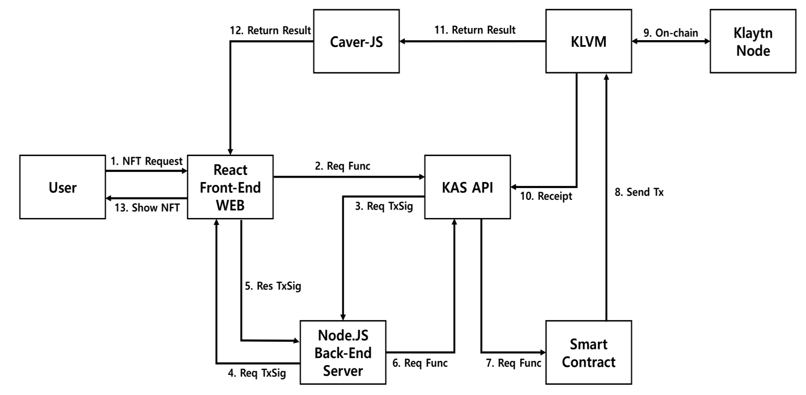
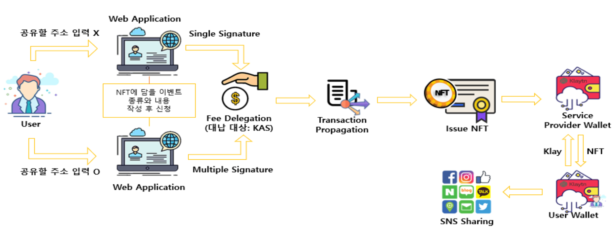

# JeJu-Blockahin-Hackathon
2020 JeJu Blockchain Hackathon Project

### Team SKKRYPTO

■ Ground X KAS

[블록해시값 or 트랙잭션해시값(Klaytn)]
- 0xec983f536427b97f0dfc4f24bd4b8168cdadae683270ae267f34586babd07a56 

[어카운트 아이디(KAS)] 
- 0077df69-bbf1-4dbf-8853-6ca46b1d1ca2 (main)
- 17f89661-ce7b-4072-9ae8-90c6e2384f96 (sub)

[컨트랙트 주소]
- 0x1c0ca9a6aa431b39438aeac9133176987dbb6aaf

### 서비스 모델 구현 및 결과

- #### Issue NFT
이벤트를 기록하고 이를 NFT를 발급받을 수 있는 것으로, 우리 서비스 의 핵심 기능이라고 말할 수 있습니다. 출생하는, 출생한 아이를 위한 탄생(기념) NFT, 지인의 생일 축하 NFT, 연인과의 기념일 NFT 등 특별 한 순간을 나만의 디지털 기억으로 남길 수 있습니다. 해당 순간에 대 한 사진과 함께 그 시간을 묘사하는 문구를 기입하면 유일무이한 디지 털 수집품을 갖게 됩니다

- #### Signature
두 개의 서명 기능을 구현하였습니다. 해당 기능은 초기 NFT를 발행할 때 공유 주소를 입력하는 여부에 달려있습니다. 탄생 NFT나 연인 기념일 NFT 등 본인의 NFT를 다른 지갑의 주인과 함께 공유하고 싶은 것이라면, 공유할 주소를 입력하여 MultiSig가 필요한 트랜잭션이 만들어집니다. 반 대로 홀로 소유하고 싶은 경우에는 공유할 주소를 입력하지 않으면 SingleSig로 트랜잭션이 만들어집니다.

- #### Ownership
각 사용자는 서비스 가입 시 KAS Wallet API를 통해 주소가 발급됩니다. 서비스 내에서 발급된 주소를 통해 고객들의 NFT가 보관됩니다. 새롭게 발급된 클레이튼 주소에서 기존에 본인이 소유하고 있던 주소로 토큰을 이동시키고자 한다면 일정 금액(수수료)를 결제하여 옮길 수 있게 됩니다.

- #### Fee Delegation
대납 기능을 통해 고객들이 NFT를 발행할 때 발생할 수 있는 수수료를 서비스 내에서 대신 처리해줍니다. 고객의 요청과 함께 Tx에 대한 서명이 처리되면, 수수료 계산이 발생합니다. NFT 발급을 위한 계산된 수수료의 대부분을 KAS에서 부담해줍니다.

- #### Detail Page
추가적으로 NFT 상세정보 확인 페이지를 구축하였습니다. 서비스 이용자 가 초기에 NFT 발행을 위해 기입했던 정보를 열람할 수 있는 페이지로, 해당 사진과 함께 담고 있는 정보, NFT 유효성 등을 한눈에 볼 수 있습니 다. 고객은 해당 페이지를 통해 과거의 기억이나 추억을 생생하게 떠올릴 수 있을 것입니다

- #### Key Update
블록체인 서비스를 이용하기 위해선 고객의 철저한 개인키 관리가 필요 합니다. 하지만 자신도 모르게 분실하고 까먹는 경우가 발생할 수 있습니 다. 따라서 이를 방지하기 위해 키를 업데이트 하여 새로운 키 쌍을 통해 계정을 지속적으로 이용할 수 있게 하였습니다.

- #### Tx Pending
이는 MultiSig 형태의 Tx 요청이 들어왔을 경우에 적용됩니다. Pending 상 태인 트랜잭션에 각 이용자가 sign을 해야 처리가 됩니다. 만약 pending 상태의 트랜잭션이 존재할 경우, 클라이언트에 알림이 뜨면서 sign을 할 수 있게 구현하였습니다.

- #### SNS Sharing
고객은 자신의 주소로 발급받은 NFT를 다른 서비스에 공유할 수 있는 기 회를 갖습니다. 카카오톡, 인스타그램, 페이스북에 있는 자신의 계정에 이 를 게시함으로써 다른 사람들과 해당 이벤트를 공유할 수 있게 됩니다. 또한, 이러한 기능은 SNS를 통해 직, 간접적으로 우리 서비스를 접한 사 람들의 유입 통로가 될 수 있을 것입니다.

### System Architecture

### User Flow 

1) 사용자가 웹 서비스에 등장하고, 공유주소 입력 선택 및 이벤트 내용작성

2) 이벤트 공유 주소 입력 여부에 따른 사용자의 서명 (SingleSig / MultiSig)

3) 서명확인 후, 대납 기능을 통한 수수료 제공 (대납 대상: KAS)

4) 트랜잭션이 발생하고, NFT가 발행

5) 발행된 NFT는 최초에 서비스 내에서 제공된 주소에서 보관

6) 타 서비스로의 공유시 공유 수수료 발생

7) 개인 지갑으로 전송하고 싶은 사용자는 전송 비용 지불

8) 개인지갑내NFT는공유수수료없이자유롭게공유

### 핵심 기술 및 주요 특징
- #### 이 세상에 단 하나 뿐인 나만의 수집품(기념품)
여러 일반적인 현물 수집품들과 달리, 디지털 수집품으로써 NFT는 각 토큰이 고유한 가치를 지니고 있고 다른 것으로 대체할 수 없다는 특징이 있습니다. 뿐만 아니라 발행된 NFT는 기존 토큰과 달리 동등한 가치가 존재하지 않다는 유일무이한 특징이 있어 수집품으로써 적합합니 다. 위와 같은 NFT의 성격은 일상 속 단 한 번의 특별한 순간을 기념할 수 있는 기회를 마련해 줄 것이고, 이것은 그 무엇과도 바뀔 수 없는 단 하나의 디지털 기념품이 될 수 있습니다. 따라 서 이는 블록체인의 NFT를 통해서 이뤄낼 수 있는 결과물이라고 생각합니다.

- #### 안전한 디지털 수집품 (기념품)
NFT는 현재 위, 변조 및 복제가 만연한 디지털 환경에서 의도적인 조작 문제를 막을 수 있는 블록체인 기술의 한 축입니다. 현물 수집품이 아닌, 디지털 수집품을 제공하고자 기획한 서비 스이기에 이를 보관하고 소유하는 과정에서 발생할 수 있는 문제를 최소화해야 합니다. 디지 털 환경에서는 어느 순간을 기록하고 저장하는 일이 빈번히 발생할 수 있고, 또한 그 방법이 편리할 수 있습니다. 하지만 이러한 환경은 언제나 위험에 노출되어 있고, 이를 원치 않은 사람 들이 존재합니다. 따라서 NFT를 통해 디지털 수집품을 소유하게 된다면, 이러한 위험으로 부 터 안전하게 보호받을 수 있고, 나아가 NFT를 발급함으로써 특별했던 그 순간의 기억을 10년, 20년이 지나도 온전히 보관할 수 있게 됩니다.

- #### 장점 극대화
1) 디지털환경속에서보안을강화할수있는기술 로는 블록체인이 선두에 있다고 생각합니다. 본 서비스에서 제공하는 디지털 수집품은 그 순간의 상태를 기록하는 것이므로, 기록의 보존이 굉장 히 중요합니다. 블록체인은 이러한 훼손 및 위·변 조될 수 있는 상황을 방지해줄 수 있습니다.

2) 우리 서비스에서 제공하는 대납 기능은 유저가 서비스를 더욱 적극적으로 활용할 수 있도록 합 니다. 기존 플랫폼을 통해 구현했을 시, 사용자는 NFT를 발급할 때마다 꽤나 큰 수수료를 부담해 야 했지만, 이를 대납기능을 통해 해결했습니다.

3) 우리 서비스에서 제공하는 이벤트 NFT 발급은 그 대상을 초기 탄생한 아이와 연인 및 지인을 위한 축하 및 기념을 목적으로 하고 있지만, 서비 스 이용자들이 스스로 새로운 카테고리를 만들어 보다 다양한 디지털 수집품이 생길 수 있다고 생각합니다.

- #### 단점 최소화
1) 블록체인은 아직 생소하기에 대중들에게 다가가 기 어려운 기술이라는 단점이 있습니다. 본 서비 스에서는 사용자에게 최소한의 정보를 입력하게 함으로써, 서비스 최종 결과물을 볼 수 있도록 환 경을 구축하였습니다. 이는 블록체인 서비스를 보다 편하고 빠르게 이용하도록 하기 위해서 입 니다.

2) 기존 블록체인 서비스에서는 사용자 주소의 개인 키를 분실하게 되면 해당 주소는 보안에 취약해 져 사용하지 못하게 됩니다, 하지만 클레이튼의 계정 주소와 공개키/개인키 쌍은 분리가 되어있 는 점을 살려, 사용자의 키가 분실되거나 유출되 었을 시 계정을 업데이트하여 새로운 키 쌍으로 지속적인 사용을 용이하게 했습니다.

### Contributors 

|  |  |   |
|:-----:|:-----:|:-----:|
| [JeongMin Yeo](hhttps://github.com/Youngerjesus) | [SeungHo Park](https://github.com/JoonPark0221)  |  [MinSeung Shin](https://github.com/minseungShin) |
| 🔥  | 🔥  |  🔥   |

### Please read Project Folder README.md

- <a href="project/README.md"> README.md </a>

  
